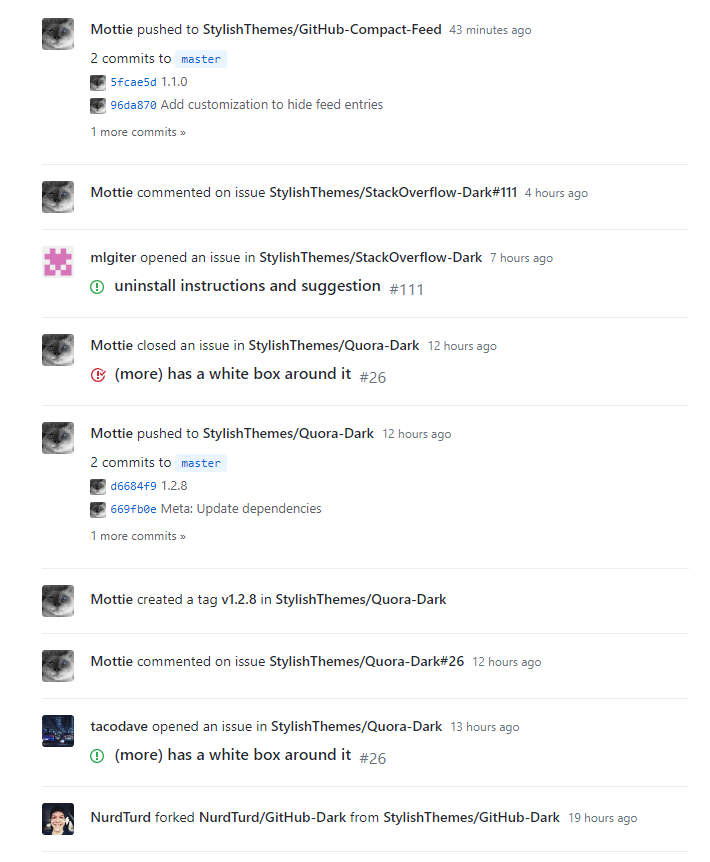
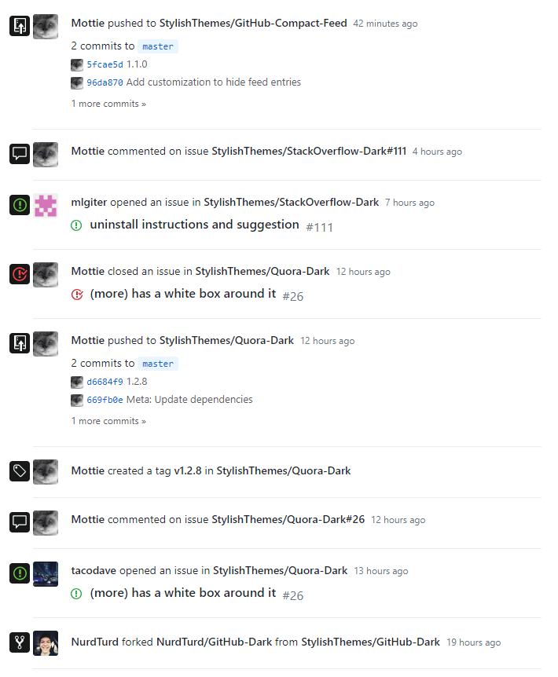
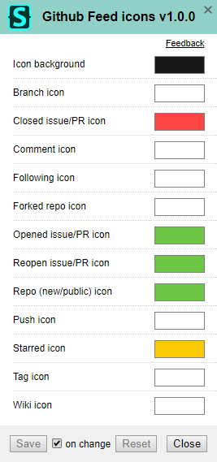

# GitHub Feed Icons 

A simple userstyle that adds icons to the news feed.

Please be aware that most feed entries have a generic class name applied:
* An open pull request will show an issue opened icon.
* A closed pull request, either merged or unmerged, will show an issue closed icon.
* A reopened issue or pull request will show an issue reopened icon.
* Issue and commit (review) comments will both show a comment icon.
* Wiki edit and creation will show a book icon.
* Repo creation and a repo made public will show the same repo icon.

## Preview

This userstyle works great along side our [compact feed style](https://github.com/StylishThemes/GitHub-Compact-Feed), as seen in these screenshots.

| Before | After |
|:------:|:-----:|
|  |  |

## Customizing

The overall feed icon background and individual icon colors may be customized.

## Installation

A userstyle extension is required, common ones include:

🎨 Stylus for [Firefox](https://addons.mozilla.org/en-US/firefox/addon/styl-us/), [Chrome](https://chrome.google.com/webstore/detail/stylus/clngdbkpkpeebahjckkjfobafhncgmne) or [Opera](https://addons.opera.com/en-gb/extensions/details/stylus/). 
🎨 xStyle for [Firefox](https://addons.mozilla.org/firefox/addon/xstyle/) or [Chrome](https://chrome.google.com/webstore/detail/xstyle/hncgkmhphmncjohllpoleelnibpmccpj).

Then:

📦 [Install the usercss](https://github.com/StylishThemes/GitHub-Feed-Icons/raw/master/github-feed-icons.user.css) with Stylus or xStyle. Supports automatic updates.

## Contributions

If you would like to contribute to this repository, please...

1. 👓 Read the [contribution guidelines](CONTRIBUTING.md).
2.  [fork](https://github.com/StylishThemes/GitHub-Feed-Icons/fork) or 
[Download](https://github.com/StylishThemes/GitHub-Feed-Icons/archive/master.zip),
3. 👌 Create a pull request!

Thanks to all that have [contributed](AUTHORS) so far!
